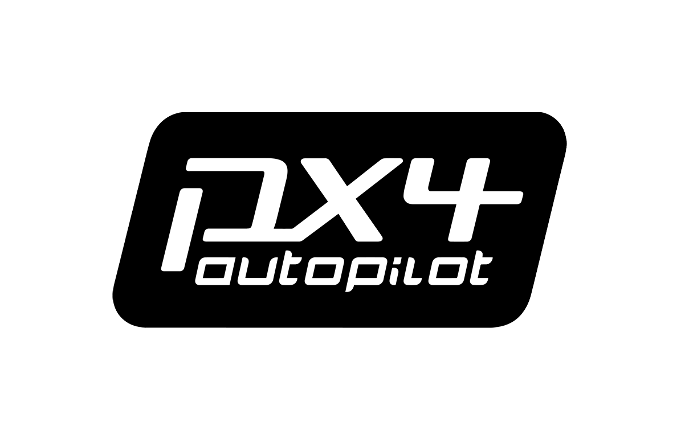
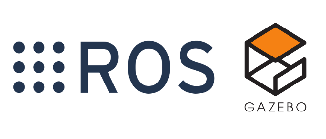

# Vision based navigation and precision landing of a drone
## _An autonomous implementation based on ROS, PX4 and ArUco markers_

  
&nbsp; &nbsp; &nbsp; &nbsp; &nbsp; 
  
  &nbsp; &nbsp; &nbsp; &nbsp; &nbsp; 
  

Ensure that you have ROS installed. The guide is based on Ubuntu 18.04, so ROS Melodic must be installed. 
Follow the guide from the official ROS webpage: http://wiki.ros.org/melodic/Installation/Ubuntu. 
It is recommended to install the ros-melodic-desktop-full package.

Install PX4 dependenciesdntial ccache clang clang-tidy cmake
cppcheck doxygen file g++ gcc gdb git lcov make ninja-build python3
python3-dev python3-pip python3-setuptools python3-wheel rsync
shellcheck unzip xsltproc zip libeigen3-dev libopencv-dev libroscpp-dev
protobuf-compiler python-pip python3-pip ninja-build gstreamer1.0-
plugins-bad gstreamer1.0-plugins-base gstreamer1.0-plugins-good
gstreamer1.0-plugins-ugly libgstreamer-plugins-base1.0-dev
libgstrtspserver-1.0-dev xvfb python-catkin-tools

pip install --user argparse cerberus empy jinja2 numpy packaging pandas
psutil pygments pyros-genmsg pyserial pyulog pyyaml setuptools six toml
wheel rosdep opencv-contrib-python

pip3 install --user --upgrade empy jinja2 numpy packaging pyros-genmsg toml
pyyaml pymavlink

Then from the software/ros_workspace/ -> . ./init_setup.bash
Now source the ros workspace -> source /opt/ros/melodic/setup.bash
Now init your workspace -> catkin build
Then source to PX4 firmware -> . ./setup_gazebo.bash

The last line can now be run everytime a new terminal is opened to source PX4
